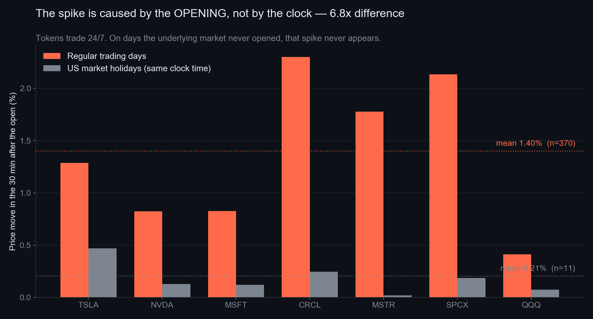
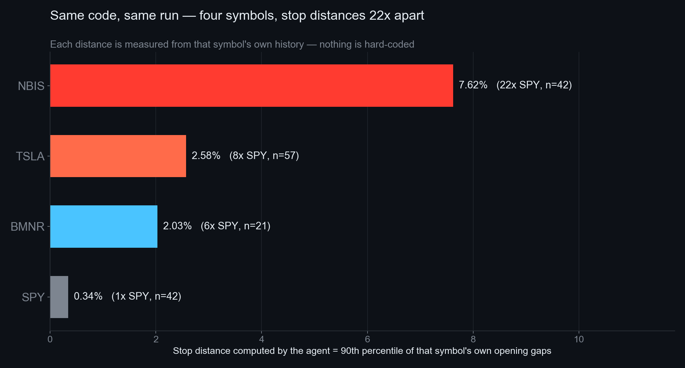

# Opening Bell

**An agent that knows what time it is.**

> Binance will sell you Tesla stock at 3 AM ET on a Sunday.
> But the real Tesla hasn't traded in 35 hours. What you see is a placeholder.

Tokenized US equities (bstock) trade on Binance 24/7. Their underlying market is open
**32.5 hours a week**. Every trading bot treats that price series as continuous.
That is a structural, shared mistake — and it is the entire premise of this project.

Opening Bell holds a *second clock*: the one belonging to the underlying market.
Before that market closes, it compresses exposure to a stated risk budget and hands
the exchange a protective order to execute while the agent is offline. It does not
predict direction. It does not chase returns. It manages an exposure most holders
cannot see.

---

## 1. The observation

Data snapshot: Binance public klines through **2026-09-03**. Re-running later adds
sessions and shifts the counts slightly; `scripts/cohort_stats.py` prints whatever
cohort it actually used.

Measured on 30-minute candles across **63 bstock symbols with sufficient history,
2,264 genuine opening events**. The 30-minute granularity matters: a 1-hour candle containing
the 13:30 open also contains 30 minutes of pre-market quiet, which dilutes the effect.

| | Off-hours volatility (per 30 min) | First 30 min after open | Ratio |
|---|---|---|---|
| SPYB (S&P 500 ETF) | 0.046% | 0.159% | 3.5x |
| TSLAB (Tesla) | 0.121% | 1.287% | **10.6x** |
| NBISB (Nebius) | 0.394% | 3.476% | 8.8x |
| **All 63 symbols (median)** | | | **7.4x** (range 3.4x–13.3x) |

While the underlying market is closed, the token's price is nearly frozen — market
makers quote it, but they do not move it. When the underlying reopens, the accumulated
price discovery is released within the first 30 minutes — the finest granularity
this analysis measures.



## 2. The causal evidence

Correlation would not be enough here, so we used a natural experiment: **US market
holidays**. On 2026-06-19 (Juneteenth) and 2026-07-03 (Independence Day observed),
the tokens traded normally on Binance, but the underlying market never opened.

| | Mean move in the 30 min after 13:30 UTC | n |
|---|---|---|
| Regular trading days | **1.401%** | 370 |
| **US market holidays** | **0.207%** | 11 |

**6.8x difference. 10 of the 11 holiday observations stayed below 0.5%.**
The spike is caused by the *opening*, not by the clock reaching 13:30.

## 3. What we did NOT find

We looked for a tradable edge before concluding there wasn't one. Two hypotheses,
verified independently on our own data (`scripts/` reproduces both):

| Hypothesis | Result | n |
|---|---|---|
| Predict gap direction from the overnight BTC move | **50.1% hit rate**, corr +0.018 | 583 |
| Post-open momentum: does the first 30 min continue into the next 30? | gross **+0.048%**/trade (t=1.05) → **−0.152% after 0.2% fees** (t=−3.31) | 585 |

The first says direction is a coin flip. The second is the more interesting one:
we measured a weak positive estimate (corr +0.082), but **the mean is not statistically
established** (t=1.05) — and at 4.8 bps gross it sits well inside the 20 bps round-trip
cost either way.

Three further hypotheses were examined during design review and failed the same way:
fading market-maker drift through the closure, leveraged-ETF pair convergence
(TQQQ/QQQ, SOXL/SOXS), and bstock-spot vs. TradFi-perpetual basis convergence. Those
came from a review pass rather than the numbers above, so we state them qualitatively:
each showed a statistically detectable edge smaller than the fee.

The pattern is consistent: **whatever edge is present is smaller than the cost of
acting on it.**

> This market's efficiency boundary is set by its own fee, not by anyone's cleverness.

That is why the structure persists unarbitraged — and why, for an agent with 301 USDT,
the only rational behaviour is to manage risk rather than chase return.

## 4. What the agent does

Risk is measured in **openings, not hours** — and this is the least intuitive finding
in the project. A weekend closure lasts 65.5 hours versus 17.5 overnight, a 3.7x
difference in elapsed time. The resulting gap is the same size:

| | Mean move at the open | n |
|---|---|---|
| Monday (after a 65.5h closure) | **2.049%** | 443 |
| Tuesday–Friday (after 17.5h) | **2.058%** | 1,821 |

**Ratio: 1.00x.** A square-root-of-time model predicts 1.93x. Information arrives on
business days, not on weekends — so a system that scales risk by calendar time would
over-hedge every weekend by nearly 2x and pay the fees for nothing.

This is why `openings_between()` returns **1** for a Friday-to-Tuesday Labor Day gap,
not 3.

```
   [LIVE]  underlying market open
      │  now >= next_close - 15min
      ▼
   [PRE_CLOSE_GUARD]              ← the only moment it acts
      │  1. n = openings_between(now, next_open)
      │  2. stress_loss = notional × p90 × sqrt(n)
      │  3. trim positions above the equal-risk budget
      │  4. place STOP_LOSS_LIMIT for what remains
      ▼
   [BLIND]  market closed — no directional action, by design
      │  the price here is a placeholder; watching it is a mistake
      ▼
   [RECONCILE]  after the open — measure the realised gap, update calibration
```

Stop distances are **measured per symbol, never hard-coded**:



| Symbol | Calibrated p90 gap | Samples |
|---|---|---|
| SPYBUSDT | 0.34% | 42 |
| BMNRBUSDT | 2.03% | 21 |
| TSLABUSDT | 2.58% | 57 |
| NBISBUSDT | 7.62% | 42 |

Same code, same run, **22x difference** in stop distance.

## 5. Why this needs an agent, not a bot

**2026-09-07 is Labor Day. The US market is closed.**

A scheduler written as `30 13 * * 1-5` fires that Monday for an opening that does not
exist. Our crontab is `*/15 * * * *` — it knows nothing about market hours. Every
temporal decision lives in one place, `src/market_clock.py`, which is the only module
in this repository with mandatory unit tests:

```python
def test_labor_day_2026():
    assert clock.next_open(utc("2026-09-04T20:00Z")) == utc("2026-09-08T13:30Z")
    assert clock.openings_between(utc("2026-09-04T20:00Z"), utc("2026-09-08T13:30Z")) == 1
```

The agent's own log states it plainly:

```
2026-09-05 is a weekend; US equity market closed;
2026-09-06 is a weekend; US equity market closed;
2026-09-07 is Labor Day; US equity market closed
```

## 6. Architecture

Binance MCP is authorised via OAuth — there is no API key, so **Python cannot place
orders**. This forced a clean split, and it turns out to be the right one:

```
cron (*/15, knows nothing about markets)
   └─ ops/tick.sh ── MarketClock: are we in the guard window?
         └─ (only if yes) claude -p ── the agent
               ├─ Binance MCP: read account + prices
               ├─ python -m src.decide  ← pure, testable, no side effects
               └─ Binance MCP: place orders, verify, log
```

The agent cannot compute its own risk numbers, and the calculator cannot trade.
Neither half can go rogue alone.

**There is no WebSocket, and that is deliberate.** Off-hours prices are noise by the
very evidence in §2; polling them would be a mistake. Repricing plays out over the opening half-hour,
not in milliseconds — this is a slow, calendar-driven event, which is exactly the kind
of market event an LLM agent is suited to.

## 7. Live results

Real capital, real orders, in an Agentic sub-account.

- Deployed: **179 USDT** of exposure across four symbols, equal-risk weighted
- Risk budget: 1.5% of equity per opening event
- If all four stops fill at their limit prices, the mark-to-limit loss from the
  snapshot is about **−7.2 USDT**. A gap straight through the limit can leave an
  order unfilled — a stop-limit caps the price, not the loss.

Positions opened 2026-09-03, equal-risk weighted: three of the four sit between 1.11
and 1.21 USDT of stress loss against the same 1.128 USDT per-symbol budget. SPYB is capped by a concentration limit rather
than by risk: at a 0.34% p90 gap, equal-risk weighting would demand a 329 USDT position,
which exceeds the entire account. **That constraint is structural, not a funding
shortfall** — the required notional scales linearly with equity, so no amount of capital
resolves it. Every risk-parity book needs a concentration cap for exactly this reason.

Decision reasoning and order receipts are committed to `log/` as each session runs:
`log/decision_<date>.json` (what it decided and why) and `log/execution_<date>.jsonl`
(order IDs and exchange-verified order status). The 2026-09-04 close is the notable one — it is the
session whose next open is Tuesday the 8th, not Monday the 7th.

## 8. Limitations — stated up front

1. **The natural experiment rests on 2 dates.** 11 observations. It is our strongest
   causal evidence and also our thinnest. It is corroborated independently by the
   60-trading-day off-hours/open comparison, which does not depend on those dates.
2. **n=2,264 is not 2,264 independent observations.** They span only 57 distinct
   trading days, and symbols are highly correlated within any given day. The effective
   sample size is closer to the number of days than the number of rows.
3. **bstock listed in June 2026.** Per-symbol history is 21–59 opening events.
   We use the empirical p90 with a 2-percentage-point buffer on the limit leg, and call
   the output a *stress loss*, never a VaR — the sample cannot support a statistical claim.
4. **Expected P&L is negative.** Fees are ~0.2% per round trip. We report variance
   reduction and the fee paid for it, not returns.
5. The holiday calendar is hard-coded for 2026–2027 (source: NYSE). Beyond that it must
   be updated.
6. Code comments are in Chinese; all runtime output, logs and docs are in English.

## 9. Reproduce it

See **[REPRODUCE.md](REPRODUCE.md)** — a full walkthrough from zero, including the
four environment traps that cost us hours and will silently break an unattended run.

## 10. Considered and deliberately dropped

- **Hedging with TradFi perpetuals.** `TSLAUSDT` and dozens of other `TRADIFI_PERPETUAL`
  contracts exist on the same underlyings and also trade 24/7. Their basis against
  bstock spot is far tighter than the gap itself, so a hedge would neutralise most of
  this risk — at the cost of doubling the leg count and adding liquidation risk to a
  301 USDT account. Out of scope here, but the most promising direction for future work.
  (We flag it explicitly because a reviewer who knows these contracts exist should see
  that we do too.)
- **OCO bracket orders** — not exposed in the MCP tool surface.
- **Any ML / news-sentiment direction model** — the direction is random (§3); modelling
  it would be theatre.
